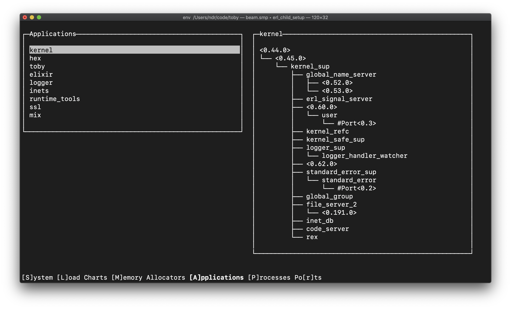
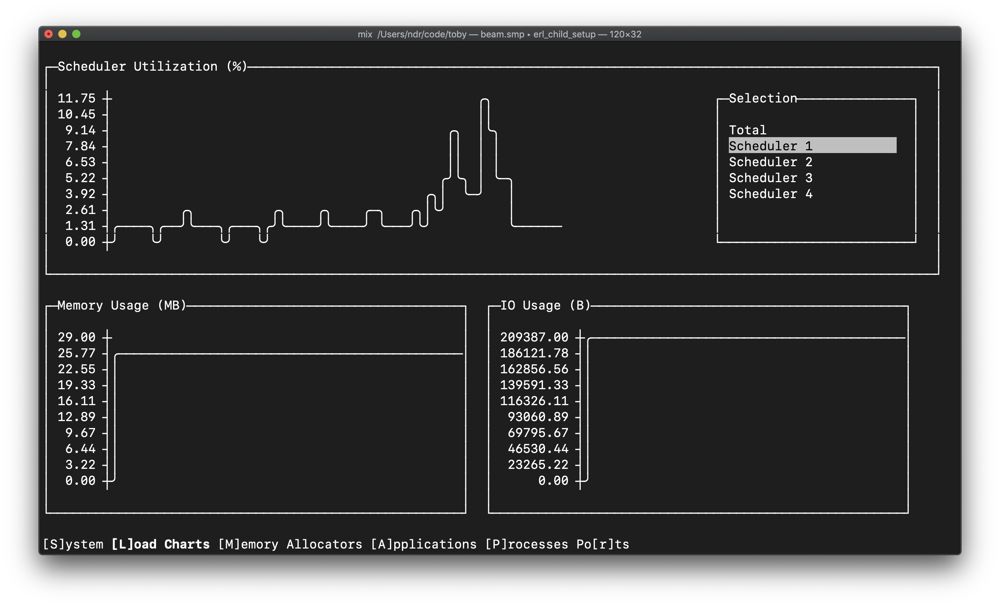

# Toby

A WIP terminal-based observer for the Erlang VM. Just an early prototype here
so far.

It's being developed in parallel with [ExTermbox][1] and [Ratatouille][2], which
respectively provide termbox bindings and a terminal UI kit for Elixir / Erlang.





## Running It

First, clone the repo and run `mix deps.get`. Then to run the application:

```bash
mix run --no-halt
```

## Building a Release

It's also possible to create a distributable, self-contained executable via
Distillery. I'd like to provide these for download in the future, but for now
you can build one yourself using the provided config.

Releases built on a given architecture can generally be run on machines of the
same architecture.

```bash
MIX_ENV=prod mix release --executable --transient
```

See the output for the location of the built executable (most likely at
`_build/prod/rel/toby/bin/toby.run`).

This is a Distillery release that bundles the Erlang runtime and the toby
application. Start it in the foreground:

```bash
_build/prod/rel/toby/bin/toby.run foreground
```

You can also move this executable somewhere else (e.g., to a directory in your
$PATH). A current caveat is that it must be able to unpack itself, as Distillery
executables are self-extracting archives.

[1]: https://github.com/ndreynolds/ex_termbox
[2]: https://github.com/ndreynolds/ratatouille
